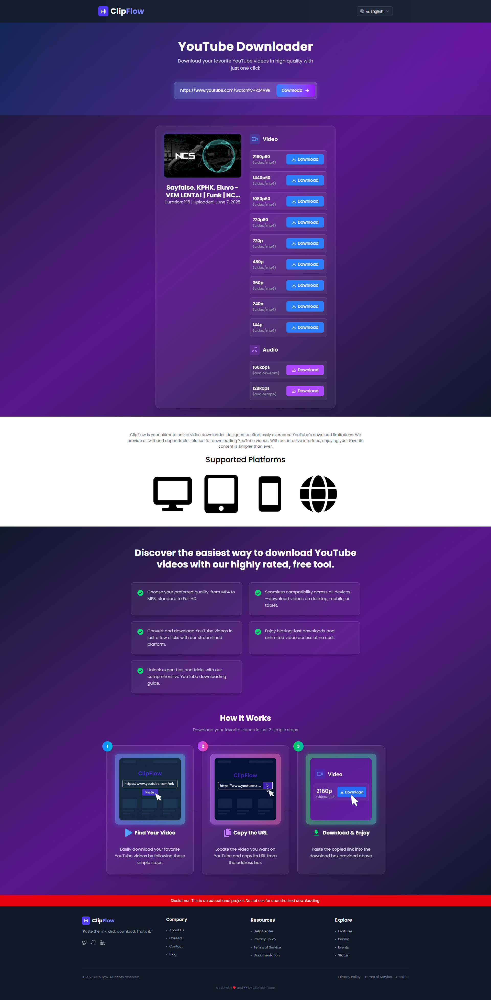

<h1 align="center ">
 <strong>ClipFlow - YouTube Video & Audio Downloader</strong> 
</h1>

<p align="center" > ClipFlow is a modern, full-stack web application that allows users to download YouTube videos and audio in various formats and qualities. It features a beautiful, responsive UI, multi-language support, and a robust Node.js backend with caching and rate-limiting protections.</p>

## Features

- 🎬 Download YouTube videos and audio in multiple qualities (MP4, MP3, etc.)
- 🌍 Multi-language support (English, French, German, Hindi, Tamil, Malayalam, Kannada, Telugu, Spanish)
- ⚡ Fast, reliable downloads with server-side proxying
- 🖥️ Responsive design for desktop, tablet, and mobile
- 🧠 Caching of video info for faster repeated requests (MongoDB)
- 🚦 Handles YouTube rate limits with exponential backoff
- 🔒 CORS and security best practices
- 🛠️ Built with React, Vite, Tailwind CSS, Express, and MongoDB

## Screenshots



## Tech Stack

- **Frontend:** React 19, Vite, Tailwind CSS, react-i18next, react-hot-toast, react-router-dom, lucide-react, react-icons
- **Backend:** Node.js, Express, ytdl-core, @distube/ytdl-core, Mongoose, MongoDB, Axios, dotenv, cors
- **Dev Tools:** ESLint, Nodemon

## Project Structure

```
client/
  src/
    components/
    layouts/
    config/
    assets/
    index.css
    App.jsx
    main.jsx
  public/
  index.html
  package.json
server/
  controllers/
  routes/
  config/
  models/
  middleware/
  index.js
  package.json
```

## Getting Started

### Prerequisites

- Node.js (v18+ recommended)
- MongoDB (local or cloud)

### Installation

#### 1. Clone the repository

```sh
git clone https://github.com/yourusername/clipflow.git
cd clipflow
```

#### 2. Setup the backend

```sh
cd server
npm install
# Create a .env file with:
# MONGO_URI=your_mongodb_connection_string
# PORT=5000
npm run start
```

#### 3. Setup the frontend

```sh
cd ../client
npm install
npm run dev
```

- Frontend runs on [http://localhost:5173](http://localhost:5173)
- Backend runs on [http://localhost:5000](http://localhost:5000)

### Environment Variables

**server/.env**
```
MONGO_URI=your_mongodb_connection_string
PORT=5000
```

**client/.env** (optional, for API base URL override)

## Usage

1. Paste a YouTube video link in the input box.
2. Click "Download".
3. Choose your preferred format and quality.
4. Download starts via server proxy.

## Internationalization

ClipFlow supports multiple languages. Use the language selector in the header to switch.


## Security & Disclaimer

- This project is for educational purposes only.
- Do not use for unauthorized downloading of copyrighted content.
